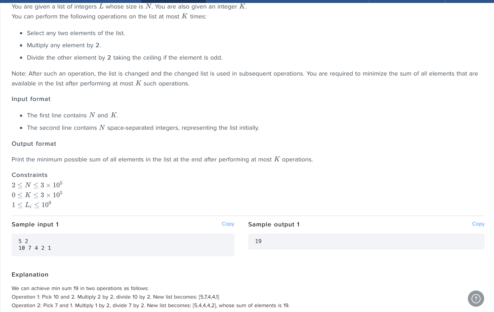

##Leonteq HackerEarth Coding Question (scala/java restriction)

#####Q1) K operation with 1 elem multiply by 2 and other divide by 2  to minimize the sum of given array. 

#####Q2) Given an array find the Box number for the marble 1st box contain 1 to M1 balls second box contain M1+1 t0 M1+M2 balls ad so on in short, if given array is (2 3 3) then Box 1 has ball # {1,2} , box 2 has ball # {3,4,5} and box 3 has ball #{6,7,8}
 
